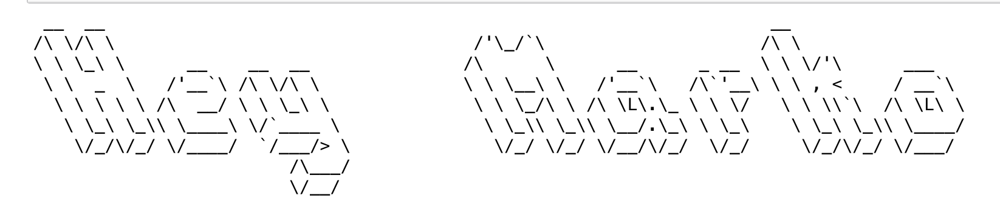

# 🧪 Setup Test

> - name: setup-test
> - ops-run-with: jupyter
> - python>=3.8
> - canvasapi>=2.0.0
> - supports universal environment 🌎

Test project to use when working through the [setup docs](https://github.com/saud-learning-services/instructions-and-other-templates).

## Details

- You will need to give this tool an activate Canvas API token for it to work. There are two methods of doing this (we recommend getting familiar with both):
  1. Set your token to the `CANVAS_API_TOKEN` field in the `.env` file
  2. Delete the `.env` file and the Jupyter Notebook will prompt you to paste in your token as input (this is the more common way to input tokens for Ops tools)
- if everything is setup correctly you should see an output like the following

    

(instead displaying _your_ first name as it appears on Canvas)
